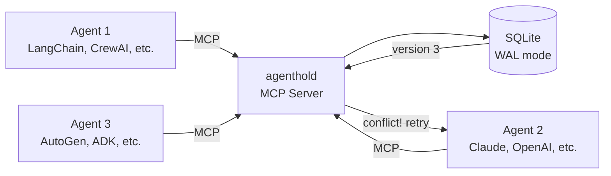

# agenthold

**Stop your AI agents from silently overwriting each other.**

When two agents update the same value, the second write quietly destroys the first. No error, no exception, just wrong data and a system that keeps running. agenthold is an MCP server that gives agents shared, versioned state with conflict detection built in. Think of it as `git` for your agents' working memory.

[](https://github.com/edobusy/agenthold/actions/workflows/ci.yml)
[](https://pypi.org/project/agenthold/)
[](https://pepy.tech/projects/agenthold)
[](https://github.com/edobusy/agenthold/actions/workflows/ci.yml)
[](https://pypi.org/project/agenthold/)
[](https://github.com/astral-sh/ruff)
[](https://glama.ai/mcp/servers/edobusy/agenthold)
[](LICENSE)

---

## The problem

When two agents update the same value at the same time, the second write silently overwrites the first. No exception is raised. The value is wrong. The system keeps running.


Two agents read a `$10,000` budget and allocate from it independently. Total committed: `$15,000`. The budget object never complains. This is a **read-modify-write conflict**: each agent's write assumes nothing changed since its read.

---

## How it works

agenthold solves this with **optimistic concurrency control (OCC)**, the same mechanism Postgres uses in `UPDATE ... WHERE version = N` and DynamoDB uses in conditional writes.

Every value stored in agenthold has a version number. When an agent writes, it passes the version it read. If the stored version has changed since the read, the write is **rejected** with a `ConflictError` that includes the current value. The agent re-reads, recalculates, and retries.


The losing agent detects the conflict, re-reads the real remaining budget (`$2,000`), and adjusts its allocation. The total committed is always exactly `$10,000`. Every write is tracked.

OCC is the right fit for agent workflows because:
- Agents do work between reads and writes (network calls, LLM inference). You cannot hold a database lock across that work.
- Conflicts are rare. Retrying once is cheaper than acquiring a lock on every read.
- The retry logic is simple, explicit, and fully in the agent's control.

---

## Works with any agent framework

agenthold connects via [MCP (Model Context Protocol)](https://modelcontextprotocol.io), the open standard for tool integration. Any framework that speaks MCP can use agenthold with zero glue code.

| Framework | How to connect |
|---|---|
| **Claude Desktop / Claude Code** | Built-in: add to `mcpServers` config |
| **Cursor / Continue / Windsurf** | Built-in: add to MCP config |
| **LangChain / LangGraph** | [`langchain-mcp-adapters`](https://github.com/langchain-ai/langchain-mcp-adapters) |
| **CrewAI** | Native `mcps` field on Agent |
| **OpenAI Agents SDK** | Built-in `mcp_servers` param |
| **Google ADK** | Built-in MCP Toolbox |
| **AutoGen** | [`autogen_ext.tools.mcp`](https://microsoft.github.io/autogen/stable//user-guide/core-user-guide/components/workbench.html) |
| **PydanticAI** | Native MCP integration |

agenthold is not a framework. It is **shared infrastructure** that sits underneath your orchestration layer, the same way a database sits underneath your application. Your agents keep their existing tools and logic; agenthold adds the coordination primitive they are missing.

> **Not using MCP yet?** agenthold also works as a [Python library](#use-as-a-python-library) you can call directly from any framework. Import `StateStore`, call `.get()` and `.set()` with version checks, and you have conflict-safe shared state.

---

## Architecture



Every write carries a version number. If the stored version has changed since an agent's read, the write is rejected and the agent retries with current data. This is the same mechanism used by Postgres conditional updates and DynamoDB conditional writes.

---

## Quick start

### 1. Install

```bash
pip install agenthold
# or
uv pip install agenthold
```

### 2. Add to your MCP client config

```json
{
  "mcpServers": {
    "agenthold": {
      "command": "agenthold",
      "args": ["--db", "/path/to/state.db"]
    }
  }
}
```

### 3. Done

Agents automatically coordinate. No CLAUDE.md, no system prompt changes, no namespace design.

When an agent connects, it sees five self-documenting tools: `agenthold_register`, `agenthold_claim`, `agenthold_release`, `agenthold_status`, and `agenthold_wait`. The tool descriptions tell the agent when and how to use each one. Server instructions reinforce the protocol when the MCP client includes them.

---

## Resources

agenthold identifies resources by canonical URIs. Tools accept either form:

- **Bare path** (e.g. `"src/main.py"`) — resolves against the workspace named `default`, or the only configured workspace if exactly one exists.
- **Explicit URI** — `"file://<workspace>/<path>"` for files, `"custom://<name>"` for opaque resources.

Equivalent inputs (`./src/main.py`, `src\main.py`, `src//main.py`, an absolute path inside the workspace) all canonicalize to the same internal URI, so two agents using different shorthands never fragment the keyspace. Path traversal (`..`) and dot segments (`.`) are rejected at the boundary.

Configure workspaces with `--workspace name=path` (repeatable). With no flag, agenthold creates a single `default` workspace at the current working directory. Multi-workspace setups let one agenthold process coordinate across separate codebases.

---

## Tools

agenthold exposes five coordination tools by default.

### `agenthold_register`

Register yourself and receive a unique agent ID. Must be called once before using `agenthold_claim` or `agenthold_release`.

```json
{ "name": "editor-agent", "model": "claude-sonnet-4-6" }
```

```json
{
  "status": "registered",
  "agent_id": "agent-a1b2c3d4",
  "name": "editor-agent",
  "registered_at": "2026-03-18T10:00:00+00:00"
}
```

---

### `agenthold_claim`

Claim exclusive access to a resource before modifying it. Requires a registered `agent_id`.

```json
{ "resource": "intro.md", "agent_id": "agent-a1b2c3d4" }
```

**Claimed** (you hold exclusive access):
```json
{ "status": "claimed", "resource": "file://default/intro.md", "version": 1 }
```

If the resource has a non-trivial prior history (deleted, moved, abandoned, or expired), the response also carries `previous_outcome`, `previous_holder`, `previous_outcome_at`, and a `hint` describing what the previous holder did. For `previous_outcome: "moved"`, `moved_to` is the new resource URI.

**Busy** (another agent is working on this resource):
```json
{
  "status": "busy",
  "resource": "file://default/intro.md",
  "held_by": "agent-e5f6g7h8",
  "claimed_at": "2026-03-18T10:00:00+00:00",
  "hint": "Another agent holds this resource. Work on a different resource, or call agenthold_wait to be notified when it becomes available."
}
```

**Already claimed** (you already hold this claim, idempotent):
```json
{ "status": "already_claimed", "resource": "file://default/intro.md", "version": 1 }
```

---

### `agenthold_release`

Release your claim with an explicit outcome describing what you did. The outcome is preserved in the free-state record and shown to the next claimant so they don't act on stale assumptions. Requires a registered `agent_id`.

```json
{
  "resource": "intro.md",
  "agent_id": "agent-a1b2c3d4",
  "outcome": "modified"
}
```

```json
{ "status": "released", "resource": "file://default/intro.md", "version": 2, "outcome": "modified" }
```

Outcomes: `released` (default — no lifecycle claim), `modified` (changed in place), `created` (didn't exist before), `deleted` (no longer exists at this resource), `moved` (relocated — also pass `moved_to` with the new resource).

For renames (`mv old new`): claim BOTH paths, do the rename on disk, then release the source with `outcome: "moved", moved_to: "new"` and the destination with `outcome: "created"`.

---

### `agenthold_status`

Check whether a resource is available or currently claimed. Does not require registration.

```json
{ "resource": "intro.md" }
```

**Available:**
```json
{ "status": "available", "resource": "file://default/intro.md" }
```

If a previous holder declared a non-trivial outcome (`deleted`, `moved`, `abandoned`, `expired`), the response also includes `previous_outcome`, `previous_holder`, `previous_outcome_at`, and a `hint`. For `moved`, `moved_to` is the new resource URI.

**Claimed:**
```json
{
  "status": "claimed",
  "resource": "file://default/intro.md",
  "held_by": "agent-e5f6g7h8",
  "agent_name": "editor-agent",
  "agent_model": "claude-sonnet-4-6",
  "claimed_at": "2026-03-18T10:00:00+00:00",
  "version": 3
}
```

---

### `agenthold_wait`

Wait for a claimed resource to become available. Blocks the agent turn until the holder releases, or the timeout expires.

```json
{ "resource": "intro.md", "timeout_seconds": 30 }
```

**Available** (resource was released):
```json
{ "status": "available", "resource": "file://default/intro.md", "elapsed_seconds": 2.4 }
```

When the wait fires on a release with a non-trivial outcome, the response also carries `previous_outcome`, `previous_holder`, `previous_outcome_at`, optional `moved_to`, and a `hint`. An agent that was waiting to edit a moved or deleted resource learns *why* the path became available.

**Timeout:**
```json
{
  "status": "timeout",
  "resource": "file://default/intro.md",
  "held_by": "writer-2",
  "elapsed_seconds": 30.2,
  "hint": "The resource was not released within the timeout. Try working on a different resource, or call agenthold_wait again with a longer timeout."
}
```

---

## Advanced tools

For custom coordination protocols, agenthold exposes eight low-level primitives via `--tools advanced`:

`agenthold_get` · `agenthold_set` · `agenthold_list` · `agenthold_history` · `agenthold_delete` · `agenthold_watch` · `agenthold_clear_namespace` · `agenthold_export`

These give agents direct read/write/watch access to the versioned state store with full OCC conflict detection. No server instructions are sent in this mode.

**[See the full advanced tools reference →](docs/advanced-tools.md)**

---

## Conflict detection

The read-modify-write pattern with `expected_version` is the core of agenthold. Here is the canonical retry loop:

```python
from agenthold.store import StateStore
from agenthold.exceptions import ConflictError

store = StateStore("./state.db")

record = store.get("campaign", "budget")   # read once before doing work
do_expensive_work()                         # LLM call, API request, etc.

while True:
    new_value = compute_new_value(record.value)
    try:
        store.set(
            "campaign", "budget", new_value,
            updated_by="my-agent",
            expected_version=record.version,
        )
        break   # write succeeded
    except ConflictError:
        record = store.get("campaign", "budget")   # re-read and retry
```

**Why this works:** The version number is the contract. If the stored version has advanced since your read, another agent wrote first. You take the current value, recalculate, and try again. The number of retries is bounded by the number of concurrent writers. In practice, agents almost never conflict more than once.

**Why not locks?** Locks require a lease mechanism (what happens if the agent crashes holding a lock?), add latency on every read, and interact badly with the long I/O waits inherent in agent workflows. OCC pays a cost only when there actually is a conflict.

---

## Use as a Python library

```python
from agenthold.store import StateStore
from agenthold.exceptions import ConflictError

store = StateStore("./state.db")

# Write a value (first write, no conflict check needed)
store.set("order-1234", "status", "received", updated_by="intake-agent")

# Read it back; always get the version number too
record = store.get("order-1234", "status")
print(record.value)    # "received"
print(record.version)  # 1

# Write with conflict detection; pass the version you read
try:
    store.set(
        "order-1234", "status", "processing",
        updated_by="fulfillment-agent",
        expected_version=record.version,  # rejected if another agent wrote first
    )
except ConflictError as e:
    # Another agent wrote between your read and write.
    # e.detail has the current version, value, and who wrote it.
    record = store.get("order-1234", "status")
    # ... recalculate and retry
```

---

## What it looks like in practice

In a multi-agent session, the coordination is automatic. An agent's tool calls look like this:

```
Agent A: agenthold_register(name="writer", model="claude-sonnet-4-6")
         → agent_id: "agent-a1b2c3d4"

Agent A: agenthold_claim(resource="chapter-3.md", agent_id="agent-a1b2c3d4")
         → status: "claimed", resource: "file://default/chapter-3.md"

Agent B: agenthold_claim(resource="chapter-3.md", agent_id="agent-e5f6g7h8")
         → status: "busy", hint: "Work on a different resource..."

Agent A: agenthold_release(resource="chapter-3.md", agent_id="agent-a1b2c3d4", outcome="modified")
         → status: "released", outcome: "modified"
```

No system prompt engineering. The tool descriptions guide the agents.

### Worked examples

Two worked examples are included, each with a "before" and "after" script.

**Order processing**: two agents update the same order record concurrently:

```bash
uv run python examples/order_processing/without_agenthold.py   # silent overwrite
uv run python examples/order_processing/with_agenthold.py      # conflict detection + retry
```

**Budget allocation**: two agents draw from a shared marketing budget:

```bash
uv run python examples/budget_allocation/without_agenthold.py  # $10k budget → $15k committed
uv run python examples/budget_allocation/with_agenthold.py     # exact allocation, full audit trail
```

---

## Configuration

```bash
agenthold --db ./state.db                              # standard mode (default)
agenthold --db ./state.db --tools advanced             # advanced mode
agenthold --db ./state.db --claim-ttl 1800             # standard + 30 min TTL
agenthold --workspace myproj=/abs/path                 # named workspace
agenthold --workspace a=/x --workspace b=/y            # multiple workspaces
agenthold --transport http --port 8417                 # serve over HTTP (see below)
```

| Flag | Default | Description |
|---|---|---|
| `--db` | `./agenthold.db` | Path to the SQLite database file. Use `:memory:` for an in-process store (testing only; data is lost when the process exits). |
| `--tools` | `standard` | Tool set: `standard` (register/claim/release/status/wait) or `advanced` (get/set/delete/watch/list/history/clear/export). |
| `--claim-ttl` | None (no expiry) | Seconds before an inactive agent's claims expire. Only applies in standard mode. When set, claims held by agents whose last activity exceeds this value are treated as expired and can be taken by other agents. Recommended with `--transport http`. |
| `--workspace` | one workspace named `default` at the current working directory | Configure a workspace as `name=path` (e.g. `myproj=/abs/path`) or as an absolute path (name derived from the basename). Repeatable. Multiple workspaces let one agenthold process coordinate across separate codebases against the same database. Bare paths in tool inputs resolve against the workspace named `default`, or against the only configured workspace if exactly one exists. |
| `--transport` | `stdio` | `stdio` (one local subprocess per agent) or `http` (one long-lived server many agents connect to over Streamable HTTP). |
| `--host` | `127.0.0.1` | HTTP bind address. Only used with `--transport http`. |
| `--port` | `8417` | HTTP port. Only used with `--transport http`. |
| `--path` | `/mcp` | HTTP endpoint path the MCP transport is mounted at. Only used with `--transport http`. |
| `--json-response` | off | Return JSON responses instead of SSE streams over HTTP. Only used with `--transport http`. |
| `--allowed-host` | none | Enable DNS-rebinding protection and allow this `Host` header value. Repeatable. When omitted, protection stays disabled (localhost-friendly). Only used with `--transport http`. |

The database file is created automatically on first run. Back it up like any other SQLite file.

### HTTP transport

By default agenthold speaks **stdio**: your MCP client spawns one agenthold
subprocess per agent, and those subprocesses coordinate through the shared
SQLite file on the same machine. That is perfect for local, single-machine
multi-agent runs.

To coordinate agents that live in **different processes, containers, or hosts**,
run one long-lived agenthold server over **Streamable HTTP** and point every
agent at it:

```bash
agenthold --db ./state.db --transport http --host 127.0.0.1 --port 8417 --claim-ttl 1800
```

Then connect MCP clients by URL instead of by command:

```json
{
  "mcpServers": {
    "agenthold": {
      "url": "http://127.0.0.1:8417/mcp"
    }
  }
}
```

All five standard tools (and the advanced set, with `--tools advanced`) work
identically over HTTP — only the transport changes. Because a single server now
serves many agents over its lifetime, set `--claim-ttl` so a claim held by an
agent that disconnects is automatically reclaimable.

> **Security.** The HTTP transport has **no authentication yet**. The default
> bind address is `127.0.0.1` (localhost only). Do not expose it on a public
> interface without putting your own authentication in front of it. Pass
> `--allowed-host <host>` (repeatable) to enable DNS-rebinding (Host-header)
> protection when binding beyond localhost. Binding to a non-loopback address
> prints a startup warning.

> **Long-lived servers.** agenthold does not yet reap idle agent records, so a
> server that runs for a very long time with high agent churn will accumulate
> agent metadata. Set `--claim-ttl` (so disconnected agents' claims recover) and
> restart periodically if needed. Automatic reaping is on the roadmap.

---

## Development

```bash
git clone https://github.com/edobusy/agenthold.git
cd agenthold
uv sync --all-extras --dev
```

**Run the tests:**
```bash
uv run pytest tests/ -v
```

**Check coverage:**
```bash
uv run pytest tests/ --cov=agenthold --cov-report=term-missing
```

**Lint and type-check:**
```bash
uv run ruff check src/ tests/
uv run ruff format src/ tests/
uv run mypy src/
```

CI runs on Python 3.11 and 3.12 on every push to `main`. See [CONTRIBUTING.md](CONTRIBUTING.md) for detailed guidelines.

---

<details>
<summary><strong>Technical notes</strong> (design decisions for engineers)</summary>

**Why SQLite?**
SQLite is the right tool for this scope. It is zero-dependency, ships in the Python stdlib, and runs everywhere. WAL mode is enabled so that read-only operations (exports, watches) do not block writers across processes. Write transactions use `BEGIN IMMEDIATE` to acquire the write lock upfront, ensuring OCC conflict detection works correctly even when multiple agenthold processes share the same database file. `busy_timeout` is set to 5 seconds so a second writer waits rather than failing immediately. Postgres adds an ops dependency with no benefit at this scale. The storage backend is behind a clean interface (`StateStore`) that can be swapped for Postgres when the need arises. Choosing a simple tool deliberately is not a limitation.

**Why OCC instead of pessimistic locking?**
Locks require the holder to release them, which means the system must handle crashes, timeouts, and stale holders. That complexity is not worth it when conflicts are rare. OCC pays a cost only when a conflict actually occurs: one extra read and one retry. For multi-agent workflows where agents do significant work between reads and writes (LLM inference, API calls, tool execution), OCC is the correct choice.

**What the versioning guarantees:**
Each key has a version that starts at 1 and increments by exactly 1 on every write. The `state_history` table is append-only and records every write before the live record is updated, so a crash between the two writes leaves history consistent. Deletions also write a tombstone entry to `state_history` (with `event_type: "delete"`) before removing the live record, so the full lifecycle of a key is visible in history. The ordering guarantee is per-key, not global; two different keys can have their versions updated in any order.

**What would change for production scale:**
Two things. First, replace SQLite with Postgres: better concurrent write throughput, replication, and managed hosting. The `StateStore` interface is already designed to make this a contained change. Second, add authentication: the HTTP transport (see [HTTP transport](#http-transport)) currently trusts any caller that can reach the port, so a production deployment needs at minimum an API key check in front of it. The network transport itself already exists — agenthold serves Streamable HTTP via the MCP SDK's `StreamableHTTPSessionManager`, letting remote agents connect over the network instead of requiring a local process.

</details>

---

## License

MIT. See [LICENSE](LICENSE).

---

mcp-name: io.github.edobusy/agenthold

